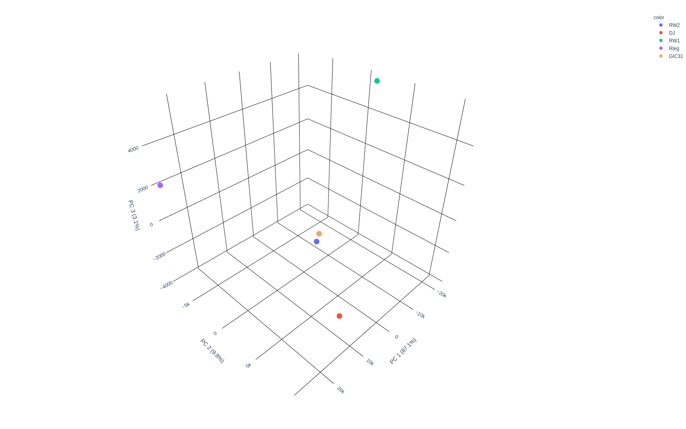

MerCat2: python code for versatile k-mer counter and diversity estimator for database independent property analysis (DIPA) for multi-omic analysis
================================================

  
**Installing MerCat2:** 
 - Available via Anaconda: Enable BioConda repo and run `conda install mercat2`   

**Source Installer**
 - Download mercat_setup.py from bin   
 - Run python mercat_setup.py to install all required dependencies   
 - Go to downloaded mercat2 folder and run commands  

**Usage**  
 - -i I path-to-input-file  
 - -f F path-to-folder-containing-input-files  
 - -k K kmer length 
 - -n N no of cores [default = all] 
 - -c C minimum kmer count [default = 10] 
 - -pro run mercat on protein input file specified as .faa 
 - -p run prodigal on nucleotide assembled contigs. 
    - Must be one of ['.fa', '.fna', '.ffn', '.fasta','fastq'] 
 - -h, --help show this help message 

By default mercat assumes that inputs provided is nucleotide mode of ['.fa', '.fna', '.ffn', '.fasta']  

**Usage examples**:

****Run mercat2 on a protein mode (protein fasta - '.faa')**** 
`python mercat2.py -i test.faa -k 3 -n 8 -c 10 -pro` 

****Run mercat2 on a nucleotide mode (nucleotide fasta - '.fa', '.fna', '.ffn', '.fasta')**** 
`python mercat2.py -i RW2.fna -k 3 -n 8 -c 10 -p`  

****Run mercat2 on a nucleotide mode raw data (nucleotide fastq - '.fastq')**** 
`python mercat2.py -i RW2.fastq -k 3 -n 8 -c 10 -p`  

****Run on many samples within a folder**** 
`python mercat2.py -f /path/to/input-folder -k 3 -n 8 -c 10` 

**Outputs**
- Results are stored in input-file-name_{protein|nucleotide}.csv and input-file-name_{protein|nucleotide}_summary.csv  
   -  file-name_protein.csv and file-name_protein_summary.csv (for example)  
- file-name_protein.csv (If run in protein mode) 
   -  Contains kmer frequency count, pI, Molecular Weight, and Hydrophobicity metrics for individual sequences. 
- file-name_protein_summary.csv (If run in nucleotide mode) 
   -  Contains kmer frequency count, pI, Molecular Weight, and Hydrophobicity metrics for individual sequences. 
- file-name_diversity_metrics.txt  
   -  Contains the alpha diversity metrics. 
- If 5 samples or more it will generate a PCA, PCA analysis for all the samples is plotted in PCA_plot.html. 

PCA analysis result for 5 sample files in data:

 
  
Citing Mercat
-------------
If you are publishing results obtained using MerCat2, please cite:

CONTACT
-------

Please send all queries to Mounika Ramapuram Naik &nbsp;&nbsp;       &nbsp; &nbsp;    
Dr. Richard Allen White III &nbsp;&nbsp;   
  
Or [open an issue](https://github.com/raw-lab/mercat2/issues).

