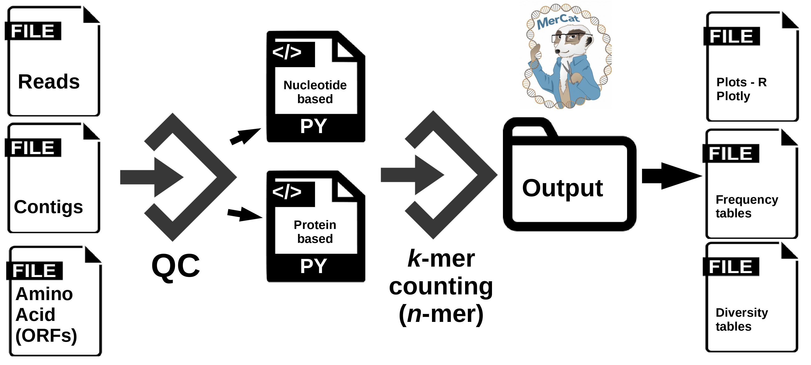

MerCat2: python code for versatile k-mer counter and diversity estimator for database independent property analysis (DIPA) for multi-omic analysis
================================================

  
Installing MerCat2: 
 - Available via Anaconda: Enable BioConda repo and run `conda install mercat2`   
 - If you would like to use pip, please install the modules listed in `dependencies.txt` via pip and run `python setup.py install` for setting up mercat.
 
  
Citing Mercat
-------------
If you are publishing results obtained using MerCat2, please cite:

CONTACT
-------

Please send all queries to Mounika Ramapuram Naik &nbsp;&nbsp;       &nbsp; &nbsp; and Richard Allen White III &nbsp;&nbsp;   

